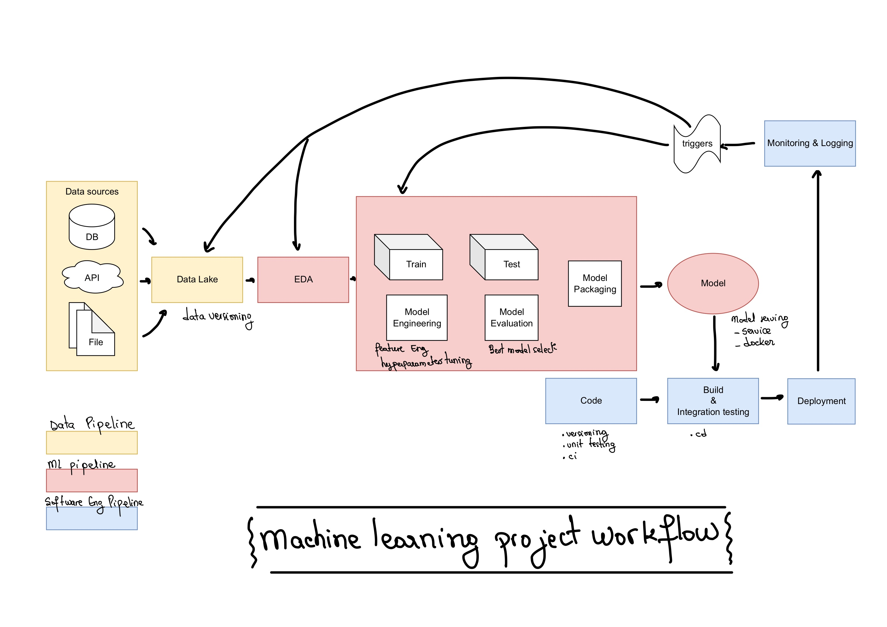

# MlOps
## Project structures
This project contains the following files:

```bash
├── .gitignore # a .gitignore file
├── conf # folder with config files
├── Dockerfile # dockerfile for prediction
├── data # .csv files for train and test
├── db # .db file for mlflow tracking storage
├── features # folder to store encoder
├── img # folder to store images
├── mlruns # will be created to store model using mlflow pkg (when running cli.py train)
├── notebooks # exploration notebooks
├── readme.md # this file
├── requirements.txt #list of required packages to make code under /src to work
├── src # main source code
├── testdata # data necessary for test
└── tests # test code
```

## Goals
This project has two components:
- a data science component under notebooks to explore different techniques to deal with class imbalance.
- an MLOps component which focus on how to think about a ML Project in a production oriented fashion using Mlflow.

| ML project workflow|
| ------------- |
|| 

### Notebooks

This project is delivered with three notebooks to illustrate the exploration phase of the work.

The dataset represents logs of a span of five minutes of a marketplace being attacked by bots that produce fake clicks and leads. Each entry contains
the user id (`UserId`), the action that a user made (`Event`), the category it interacted
with (`Category`) and a column (`Fake`) indicating if that user is fake (1 is fake, 0 is a
real user).

The task is to create a code that :
- Takes as input another .csv file with the same structure (but without the
“Fake” columns).
- Outputs a .csv file with 2 columns : “UserId” and “is_fake_probability”.

- EDA : for a little exploratory data analysis
- sampling: where I explore a undersampling.
- threshold-moving: for experimentation around threshold finding, where training is done without sampling.

The [requirements file](./notebooks/requirements.txt) contains the list of required packages for the notebooks.

PS : Warning !!! If you are using a virtual env, make sure to run your notebook with the appropriate kernel.
Follow below steps to do so:
```bash
$ conda create -n <env-name> python=3.10
$ conda activate <env-name>
$ conda install -c anaconda ipykernel
$ python -m ipykernel install --user --name=<env-name>
$ jupyter notebook
```

### MLOps
[MLflow](https://www.mlflow.org/) is an open source platform to manage the ML lifecycle, including experimentation, reproducibility, deployment, and a central model registry. MLflow currently offers four components:
- MLflow Tracking, it is organized around the concept of runs, which are executions of some piece of data science code.
- MLflow Projects, to package data science code in a format to reproduce runs on any platform.
- MLflow Model, to deploy machine learning models in diverse serving environments.
- MLflow Registry, it is a centralized model store, set of APIs, and UI, to collaboratively manage the full lifecycle of an MLflow Model.

This project investigates the 1st and the last components.

MLflow experiments can be recorded to local files, to a SQLAlchemy compatible database (mysql, mssql, sqlite, and postgresql), or remotely to a tracking server.
MLflow uses two components for storage: backend store and artifact store.
- backend store for structured data like metrics of training progress and model parameters, metadata...
- artifact store for unstructured data like files, models, images, in-memory objects...

There are a variety of storage configurations, we will use in this project:
- sqlite as a backend store
- localhost storage as an artifact store


| Storage configuration for Mlflow |
| ------------- |
|| 


PS: This part doesn't really focus on using the best model for training, but rather look at the engineering side of a ML project.
## How to run the /src code?

### Config file
The configuration can be customized using a `toml` config file located in `./conf/config.toml`

You can also use environment variables to override values, using the `APP_` prefix and the name of the parameter (use uppercase and 
`.` separating the section must be replaced by _). For example, the following command overrides the mlflow tracking uri:
```bash
APP_MLFLOW_TRACKING_URI="localhost:5050" python -m src.cli train --trainset="absolute/path/to/train/.csv" --testset="absolute/path/to/test/.csv"
```
### running the code locally

I advise running the code inside a virtual env like [conda](https://docs.conda.io/projects/conda/en/latest/user-guide/install/index.html).

```bash
# create env with <env-name> name.
$ conda create --name <env_name> python3.10

# use pip to install requirements.
$ pip install -r requirements.txt

# activate the virtual env, using the  <env_name>  you've chosen above.
$ conda activate  <env_name> 

# when you are done you can deactivate the virtual env by doing:
$ conda deactivate
```

Now that you virtual env is set up. You have to do 3 things:

1. create the sqlite database
If you don't have `sqlite` on your machine, please look at the [official webpage](https://www.sqlite.org/download.html) for download options.
```bash
# make sure your in the project directory under /db and do:
$ sqlites3 <database-name>.db

# a prompt will appear, make sure your database was created using the following command:
$ .databases
# you should see something like.
$ main: path/to/your/database/name/.db r/w
# then do the following to exit the sqlite prompt.
$ .quit
```

2. run mlflow tracking server
```bash
# you can run mlflow server locally
$ conda activate <env-name>
$ mlflow server --backend-store-uri sqlite:///db/<database-name>.db --default-artifact-root mlruns/ --host 0.0.0.0


# or you can also launch it in a docker by doing:
$ docker pull tnte/mlflow-tracking-server

$  docker run -p 5000:5000 -v /db --env BUCKET_URI_OR_LOCAL_PATH="mlruns/" --env  BACKEND_STORE_URI="sqlite:///db/<database-name>.db" tnte/mlflow-tracking-server
```

The server is accessible at http://localhost:5000.

3. run cli.py
The cli has tree options: train, predict and list-models.
```bash
# training
$ python -m src.cli train --trainset="absolute/path/to/train/.csv" --testset="absolute/path/to/test/.csv"

# list models, to have model name and version
$ python -m src.cli list-models

# predict
python -m src.cli predict --data="absolute/path/to/predict/.csv" --name="model-name" --version="model-version"
```


## Testing
To run your test file, run the following command:
```bash
# make sure you are in the working directory (/adevinta) and run:
$ python -m pytest
```
